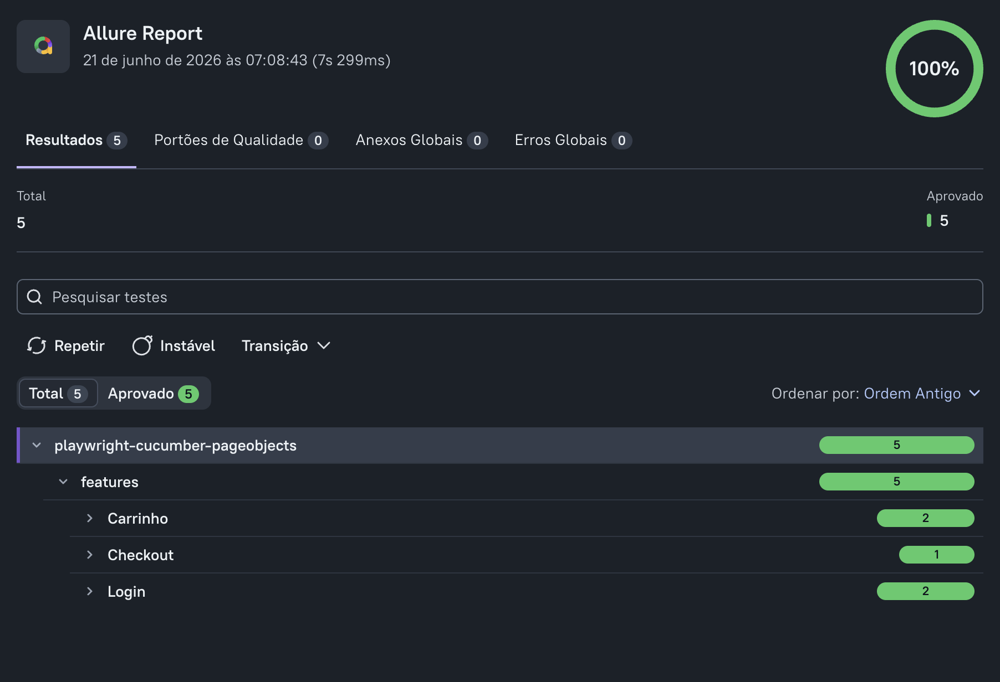

# Playwright Cucumber Page Objects JS


Projeto pessoal de automação de testes E2E utilizando **Playwright**, **Cucumber.js**, **Page Object Model**, **JavaScript**, **GitHub Actions** e **Allure Report**.

O objetivo deste projeto é demonstrar uma estrutura simples, organizada e de fácil manutenção para automação de testes web.

## Tecnologias utilizadas

* JavaScript
* Node.js
* Playwright
* Cucumber.js
* Page Object Model
* Allure Report
* GitHub Actions

## Site utilizado para testes

Os testes foram criados utilizando o site público:

**SauceDemo**

Este site é bastante utilizado para prática de automação de testes, pois possui fluxos comuns de e-commerce, como login, carrinho e checkout.

## Cenários automatizados

* Login com sucesso
* Login inválido
* Adicionar produto ao carrinho
* Remover produto do carrinho
* Finalizar compra com sucesso

## Estrutura do projeto

```text
.
├── features/
│   ├── cart.feature
│   ├── checkout.feature
│   └── login.feature
│
├── src/
│   ├── pages/
│   │   ├── CartPage.js
│   │   ├── CheckoutPage.js
│   │   ├── LoginPage.js
│   │   └── ProductsPage.js
│   │
│   ├── steps/
│   │   ├── cart.steps.js
│   │   ├── checkout.steps.js
│   │   └── login.steps.js
│   │
│   └── support/
│       └── hooks.js
│
├── docs/
│   └── images/
│       └── allure-report.png
│
├── .github/
│   └── workflows/
│       └── playwright-tests.yml
│
├── cucumber.js
├── package.json
└── README.md
```

## Como executar o projeto localmente

### 1. Instalar as dependências

```bash
npm install
```

### 2. Instalar os browsers do Playwright

```bash
npx playwright install
```

### 3. Executar os testes

```bash
npm test
```

### 4. Executar os testes com navegador visível

```bash
npm run test:headed
```

## Allure Report

Este projeto gera relatório de execução utilizando **Allure Report**.

### Gerar o relatório

```bash
npm run allure:generate
```

### Abrir o relatório

```bash
npm run allure:open
```

## Evidência do relatório



## Pipeline CI

O projeto possui pipeline configurada com **GitHub Actions**.

A pipeline é executada automaticamente em:

* Push na branch `main`
* Pull request para a branch `main`

Durante a execução, a pipeline realiza:

* Checkout do repositório
* Instalação do Node.js
* Instalação das dependências
* Instalação dos browsers do Playwright
* Execução dos testes automatizados
* Geração do relatório Allure
* Upload do relatório como artifact

## Objetivo do projeto

Este projeto foi criado como prática e portfólio técnico para demonstrar conhecimento em automação de testes web utilizando Playwright com Cucumber.js e Page Objects.

A estrutura aplica conceitos comuns em projetos reais de automação, como separação de responsabilidades, organização por camadas, escrita de cenários em Gherkin, reutilização de Page Objects, execução em pipeline e geração de relatórios.
